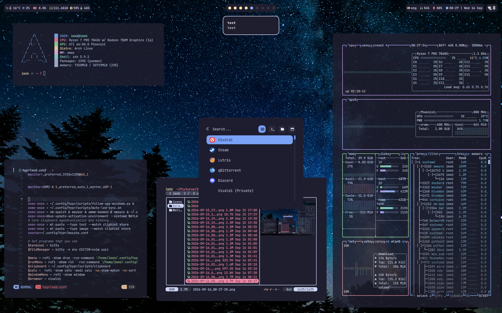
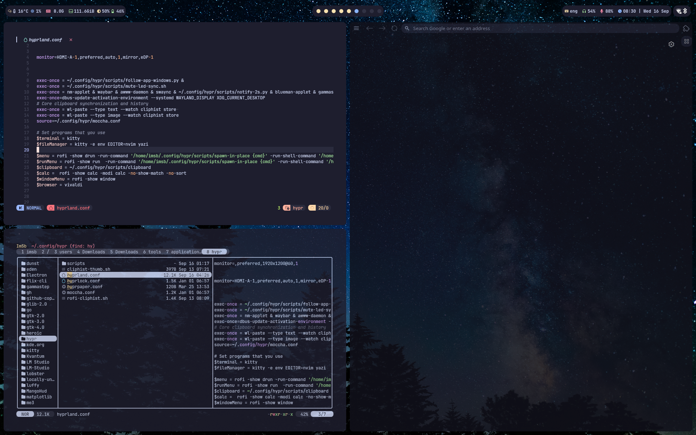

# Hyprland Dotfiles

A polished Arch Linux desktop — Hyprland, Waybar, Swaync, Yazi, Neovim, Kitty and Zsh, tuned for daily driving, full-stack dev and light gaming.

## Showcase

|  |  |
| --- | --- |
|  | Minimal workspace, wallpaper & bar |
|  | Yazi file manager with live image previews |
|  | Neovim, terminal tools and the WM in action |

## Features

- **Hyprland** with Catppuccin Mocha theming, tiling + floating layouts
- **Swaync** notifications — auto-dismiss after 2s (`notify-2s` daemon caps *any* sender timeout, including apps that send 25s), center on `Super+N`
- **Yazi**: image previews, smart-enter (archives/AppImages), Steam-folder name nicknames, session save/restore, zip-on-`B`
- **Neovim** (LazyVim): full-stack LSP — vtsls (TS/JS), HTML/CSS/JSON, pyright + ruff (Python), Tailwind completion
- **Kitty**: splits, powerline tabs, path-aware word navigation
- **Zsh**: fzf, zoxide, atuin history, syntax highlighting, emacs-style editing, f-keys wired for games
- **Media keys**: FnLock ON → `F1`–`F12` stay real for games; `FN+F1..F6` → mute / vol / mic / brightness, with LEDs synced
- **Power / fan shortcuts**: `Ctrl+Shift+Alt+1/2/3` (10W/15W/30W via ryzenadj), `0/7/9` (fan auto / level 7 / full-speed), all with toasts
- Screenshots (`Print`, `Ctrl+Print`, `Super+Print`) land in `~/Pictures/Screenshots` with a preview toast
- `install.sh` provisions a **fresh Arch** install with one command

## Requirements

- **Arch Linux** (rolling) with `sudo`
- Optional: `yay` for the small set of AUR helpers (`hyprshot`, `rofimoji`, `cliphist`, `ryzenadj`, `swaykbdd`)

## Install

```bash
git clone https://github.com/ImSb91/hyprland-dotfiles
cd hyprland-dotfiles
./install.sh
```

`install.sh` will:

1. Install all repo packages (Hyprland stack, swaync, kitty, nvim, zsh + plugins, fzf/zoxide/atuin, ryzenadj, pamixer, …) and the AUR helpers when `yay` is present
2. Deploy every config into `~/.config` (+ `~/.zshrc`), backing up anything it overwrites to `~/.dotfiles-backup-<date>`
3. Create the root helpers (`/usr/local/bin/mic-led`, `mute-led`) and NOPASSWD sudo rules for fan / wattage / ryzenadj
4. Bootstrap Neovim plugins headless on first run

Files not shipped: **secrets** (e.g. the OpenWeather key for the weather module → put it in `~/.owm-key`).

## Post-install

- **ThinkPad FnLock** onboard: run your setup on a ThinkPad you pressed `Fn+Esc`, mode `EN` — overview instantly:
  - `F1`–`F12` = real function keys; `FN+F1..F6` = media
  - Shortcuts are layout-aware (digit binds work in EN; some exist on keycap)
- Start a new Hyprland session (`Hyprland`) or reload values with `hyprctl reload`
- Open a new terminal for the zsh changes

## Keybindings

`Super` = main modifier.

| Key | Action |
| --- | --- |
| `Super+Return` | Terminal (kitty) |
| `Super+Q` | Close window |
| `Super+M` | Exit Hyprland |
| `Super+E` | File manager (kitty + yazi) |
| `Super+D` / `Alt+Space` | App menu / run menu |
| `Super+X` | Clipboard history |
| `Super+N` | Notification center |
| `Super+C` / `Super+Z` | Calculator / Rofimoji |
| `Super+1..0` | Switch workspace |
| `Super+Shift+1..0` | Move window to workspace |
| `Super+H/J/K/L` | Focus in direction |
| `Super+Shift+arrows` | Resize window |
| `Super+T` / `Super+S` | Tiled / floating |
| `Print`, `Ctrl+Print`, `Super+Print` | Screenshot: region / output / window |
| `Ctrl+Shift+R/P` | Start / stop screen record |
| `Ctrl+Shift+Alt+1/2/3` | 10W / 15W / 30W power profile |
| `Ctrl+Shift+Alt+0/7/9` | Fan auto / 7 / full-speed |
| `FN+F1..F6` | Mute / vol− / vol+ / mic / bright− / bright+ |

## Layout

```
home/.zshrc  hypr/     rofi/    swaync/    waybar/
yazi/        nvim/     kitty/   install.sh
```

Everything mirrors the live `~/.config` (plus `~/.zshrc`) so the repo *is* the backup.

## Troubleshooting

- **Notifications don't auto-dismiss?** The `notify-2s.py` daemon must run — it's part of `exec-once`, verified by `pgrep -f notify-2s.py`.
- **Volume keys feel odd?** FnLock must be ON (Esc light) so `FN+F` = media.
- **Wifi ping-ponging / buffering?** Set `802-11-wireless.bssid` in NetworkManager to your 5&nbsp;GHz AP and leave IPv6 on `ignore`.